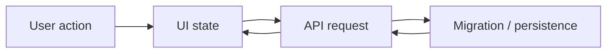

# Follow My Lead

## Overview

Read the branch and working tree before proposing solutions. Infer the user's likely destination from the existing diff, confirm that inferred intent with the user, then align on a concrete plan before editing anything.

Be thorough: carry the work through implementation, migration updates, interface changes, and broken-test repair unless the user limits scope.

## Workflow

1. Inspect the current branch and working tree first.
2. Read surrounding code to understand the local architecture, conventions, and unfinished edges around the changed files.
3. Lint, typecheck, or compile the code to see what is broken to discover the missing pieces and mismatched interfaces.
4. Infer the most likely intent from the existing artifacts, then confirm that intent with the user through lettered multiple-choice questions before asking any open-ended question.
5. Align on a concrete plan before making file edits.
6. Implement the change end-to-end.
7. Repair or update broken existing tests.
8. Ask before adding any new tests.

## Inspect The Branch

Start by gathering branch context in this order:

```bash
git branch --show-current
git status --short
git diff --stat
git diff --cached --stat
git diff -- <focused paths if needed>
git diff --cached -- <focused paths if needed>
git log --oneline --decorate -n 10
```

Then read the actual changed files. Prioritize:

- Staged diff
- Unstaged diff
- Newly added files
- Files with TODOs, placeholders, failing tests, schema changes, migrations, or interface text
- Nearby tests, configs, and type definitions

After reading the changed files, read enough surrounding code to understand:

- The module's public surface and call sites
- Adjacent types, helpers, and data flow
- Existing patterns that the partial change is trying to follow
- Nearby migrations, schemas, or contracts that constrain the implementation
- The nearest tests that describe expected behavior

Infer intent from concrete signals:

- Branch name
- File names and directory choices
- Partial implementations
- Renames and deleted code
- Existing tests that describe desired behavior
- Migration files or schema edits that imply data-shape changes
- Interface copy, component structure, and API surface changes

Do not treat the current diff as correct. Treat it as the strongest clue about direction.

## Confirm Intent First

Before editing, confirm the inferred intent with the user.

Start with intent-alignment questions. Do not begin with open-ended questions if the branch and surrounding code let you frame concrete choices.

If the direction is ambiguous, present materially different implementations as options.

If one direction is strongly supported by the artifacts, still present a recommended option plus nearby alternatives so the user can confirm or redirect the work.

When you ask, use multiple-choice options with recommendations:

```text
I see two plausible intents from the current diff. Pick one before I edit anything.

A. Recommended: finish the new async save flow and keep optimistic UI.
B. Keep the old save flow and only land the validation refactor.
C. Split the work: land the backend contract now and defer the UI behavior.
```

Rules:

- Use `A.`, `B.`, `C.` formatting.
- Mark the recommended option explicitly.
- Keep options mutually exclusive.
- Prefer one blocking question at a time.
- Base the options on evidence from the diff, not generic brainstorming.
- Ask open-ended questions only after the user rejects the provided choices or when the needed information genuinely cannot be reduced to concrete options.

## Align On A Plan Before Editing

Before any file edit, present a short plan grounded in the inspected diff. Include:

- Current branch
- What the existing changes appear to be trying to do
- Gaps or breakpoints still left open
- Files or layers you expect to modify
- Validation you will run

Keep the plan concrete. Example shape:

```text
Plan
1. Finish the backend contract started in `api/orders.ts` and `types/order.ts`.
2. Propagate the new status shape through the migration and seed data.
3. Complete the UI state handling in `OrderPanel.tsx`.
4. Repair the existing failing tests that still assert the old contract.
```

Do not start editing until the user agrees to the plan.

## Prefer Code Over Natural-Language Change Descriptions

When discussing interface options, communication copy, contracts, or behavior changes, prefer code-shaped artifacts over prose.

Prefer:

- Diff snippets
- Type definitions
- JSON examples
- API payloads
- JSX or template fragments
- Migration SQL
- Test names

Example:

```ts
type SaveMode = "draft" | "publish";
```

Prefer that over a prose-only description like "add two save modes."

When the user is choosing between interface or contract options, show alternatives in code blocks whenever possible.

## Draw Diagrams

Use diagrams to explain intended before/after behavior when the change spans more than one layer. Prefer Mermaid.

Example:



Use diagrams to clarify:

- Data flow
- Request lifecycle
- Migration impact
- Old vs. new interface states
- Cross-service contract changes

Keep diagrams small and task-specific.

## Finish The Change End-To-End

Once aligned, complete the work across all affected layers, not only the first broken file. Check for:

- Implementation gaps
- Migration updates
- Type or schema drift
- Interface regressions
- Incomplete wiring
- Dead code left by the partial refactor
- Docs or examples that are part of the shipped surface

If the branch contains unrelated user changes, avoid reverting them. Work with the existing state unless a direct conflict forces clarification.

## Handle Tests

Always run the most relevant existing tests after implementation.

Repair or update broken existing tests when they fail because the intended behavior changed.

Do not add new tests without asking first. Ask with a lettered multiple-choice prompt such as:

```text
The existing tests are repaired. New coverage would help for the new branch-specific behavior.

A. Recommended: add one focused regression test next to the existing suite.
B. Skip new tests and stop after repairing the current failures.
C. Add broader coverage for the new flow, including migration and UI behavior.
```

If the user has not approved new tests, stop at repairing existing tests and report the remaining coverage gap.

## Validation

Validate in this order:

1. Targeted tests closest to the changed files
2. Typecheck or build step if the project has one
3. Broader integration checks only when justified by the change

When validation fails, continue until you either fix the issue or can explain the blocker with concrete evidence.

## Output Style

Keep communication concise and technical.

When summarizing the work:

- Lead with what changed
- Reference the branch/diff-derived intent
- Mention repaired tests
- Call out any migrations, interface changes, or follow-up approvals still needed

If uncertainty remains, make it explicit and tie it to concrete files or diff evidence.
